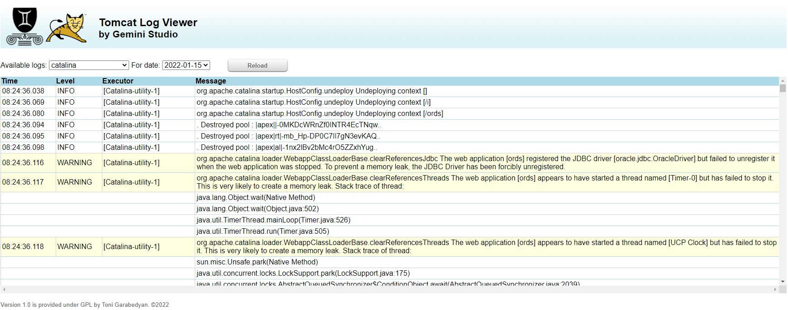

<h1>Tomcat&reg; Formatted Log Viewer</h1>

This is a simple, yet nice-to-have log viewer web-app for Apache Tomcat Server.
It simplifies browsing of the Tomcat logs, adding appropriate formatting and split content by logical parts. 
Filter content of the log folder, combining common names and then available dates.

The current version (1.2) assumes that:
<ul><li>you didn't change log's formatting valve in server.xml file of your Tomcat server, and</li>
  <li>log files are all located under <i>log</i> subfolder of CATALINA_BASE dir</li></ul>
Tested with Tomcat 9, but may works with any version if underlying JDK is 1.8+. 

<i>Sources are provided for free, if someone needs to modify the formatters or add new own features.<i>

<!---
tgarabedyan/tgarabedyan is a ✨ special ✨ repository because its `README.md` (this file) appears on your GitHub profile.
You can click the Preview link to take a look at your changes.
--->
